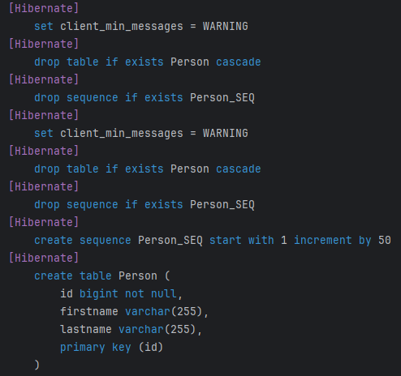

# Quarkus Reactive Test

This is a reactive REST API project built with [Quarkus](https://quarkus.io/), the Supersonic Subatomic Java framework.  
It demonstrates how to use **Hibernate Reactive with Panache**, **PostgreSQL**, and **Testcontainers** for modern, non-blocking backend development.

## ⚙️ Features

- Reactive REST endpoints using `quarkus-rest`
- Non-blocking PostgreSQL access with `quarkus-hibernate-reactive-panache`
- Hot reload and live coding in dev mode
- Testcontainers integration
- Gradle build system
- **True end-to-end streaming API endpoint (`/stream`) delivering newline-delimited JSON (NDJSON), allowing fast and easy processing of large amounts of data as it arrives**

## 🚀 Running the Application in Dev Mode

### 1. Start the PostgreSQL container

```bash
docker run --name pg-quarkus \
  -e POSTGRES_DB=demo \
  -e POSTGRES_USER=demo \
  -e POSTGRES_PASSWORD=demo \
  -p 5432:5432 \
  -d postgres:15-alpine
```

Make sure Docker Desktop is running.

### 2. Launch the application

You can run your application in dev mode that enables live coding using:

```shell script
./gradlew quarkusDev
```

> **_NOTE:_**  Quarkus now ships with a Dev UI, which is available in dev mode only at <http://localhost:8080/mika-quarkus-test/q/dev/>.  

**_Database initialization_**  
When the application starts, it will automatically create the necessary tables in your PostgreSQL database:


## 📦 Technologies

- Java 21
- Quarkus
  - quarkus-rest
  - quarkus-hibernate-reactive-panache
  - quarkus-reactive-pg-client
- PostgreSQL
- Testcontainers
- Gradle
